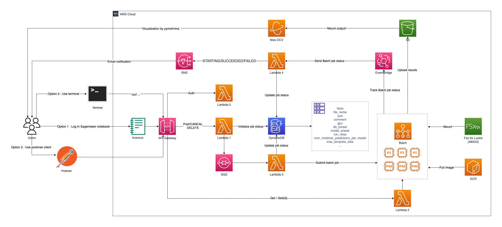

# Current support Alphafold Version : 2.2.0
Releases : https://github.com/deepmind/alphafold/releases/tag/v2.2.0
# Alphafold2 on AWS Deploy Guide:

AWS Blog：https://aws.amazon.com/cn/blogs/china/one-click-construction-of-a-highly-available-protein-structure-prediction-platform-on-the-cloud-part-one/

Architecture diagram on AWS：


## Modified Alphafold2 source code GitHub Repo：

https://github.com/wttat/alphafold

## For IAM policy when deployed please check policy.json


## Deployed steps. Based on Amazon Linux 2 AMI

1. Install Node and Npm.
```
wget https://nodejs.org/dist/v14.18.1/node-v14.18.1-linux-x64.tar.xz
tar xvf node-v14.18.1-linux-x64.tar.xz
sudo ln -s /home/ec2-user/node-v14.18.1-linux-x64/bin/node /usr/local/bin
sudo ln -s /home/ec2-user/node-v14.18.1-linux-x64/bin/npm /usr/local/bin
```
2. Set PATH env.
```
echo 'export PATH=$PATH:$(npm get prefix)/bin' >> ~/.bashrc
```
3. Install Git.
```
sudo yum install -y git
```
4. Clone Repo.
```
git clone https://github.com/wttat/af2-batch-cdk
cd af2-batch-cdk
```
5. Modify af2_batch_cdk/batch.py if needed, check details below. 
6. Set parameters via env,replace ****** to your own.


```
echo 'export KEYPAIR="******"' >> ~/.bashrc
echo 'export MAIL="******"' >> ~/.bashrc
echo 'export REGION="******"' >> ~/.bashrc
echo 'export AUTH="******"' >> ~/.bashrc
echo 'export ACCOUNTID="******"' >> ~/.bashrc
source ~/.bashrc
aws configure set default.region ${REGION}
```
**Parameter Description**:

*KEYPAIR*: The EC2 key pair's name which available in the AWS region.

*MAIL*: The email address used to receive SNS notification.

*REGION*: The region you want to deploy.

*AUTH*: The auth key used in HTTP Authentication Header.

*ACCOUNTID*: AWS Account ID.

7. Install dependancy
```
pip3 install -r requirements.txt
```
& if dependency goes wrong
```
pip3 install -r requirements.txt --use-feature=2020-resolver
```
& if in China 
```
pip3 install -r requirements.txt -i https://pypi.tuna.tsinghua.edu.cn/simple
```
8. Install CDK@v1.152.0
```
npm install -g aws-cdk@1.152.0
```
9.  If never run cdk before in this region, use below code to init cdk:
```
cdk bootstrap aws://${ACCOUNTID}/${REGION}
```
10. Generate Cloudformation template
```
cdk synth
```
11. Deploy all stacks.
```
cdk deploy --all
```
12. Confirm the SNS email to receive follow-up notification.
13. There will be an c5.9xlarge EC2 launched to download all dataset and images and save to Fsx for lustre. After everything prepared(about 3h), you will received a email notification, you could terminate the EC2 and begin to submit alphafold2 job2 via API.
14. Modify the command.json, check details below. 

## Manually Settings

1. app.py.
    
    - Line 19/20. VPC settings:
      - Create a new vpc(**Default, Highly recommended not to change**): 
      ```
      use_default_vpc=0
      vpc_id=""
      ```
      - Use default vpc:
      ```
      use_default_vpc=1
      vpc_id=""
      ```

      - Use a existed vpc:
      ```
      use_default_vpc=0
      vpc_id="{vpc_id}"
      ```

      Note: if you set use_default_vpc=1 and vpc_id at the same time, use_default_vpc will override vpc_id and use default vpc.

    - Line 75-84. Nice DCV instance(Only tested in AWS China region).
        
        Uncomment to use Nice DCV to visualize output pdb files.
2. af2_batch_cdk/batch.py
   - Line 184-205. Uncomment to use P4 batch CE.
   - Line 241-250. Uncomment to use P4 batch que.
      
      Note: You have to do this at the same time.

3. Additional settings:
   
   **This action will lower fsx price and throughput, therefore may increase the EC2 cost, please think ahead although you could edit it later.**

    If you want to deeply reduce cost, you could edit the fsx volume size in vpc_ec2.py,row 119:
    
    from
        
        storage_capacity_gib = 4800,
    to
        
        storage_capacity_gib = 2400,
    **then you have to manually change the fsx compression type to lz4 before all file are decompressed.**
    
    Or edit row 113-115 if you know what this means:
    
    ```
    #lustre_configuration={"deployment_type": fsx.LustreDeploymentType.PERSISTENT_1,
    #                     "per_unit_storage_throughput":100},
    lustre_configuration={"deployment_type": fsx.LustreDeploymentType.SCRATCH_2},
    ```

## Parameter Description of command.json 

For Job Settings:
1. fasta.type:string,**Required**:
    
    The name of protein to be predicted.
2. file_name.type:string,**Required**:
    
    The name of fasta file which stored in S3's input folder.

3. que.type:string.options:*{low/mid/high/p4}*,**Required**:
   
   The GPU instance to use,which indicated for [p3.2xlarge、p3.8xlarge,p3.16xlarge and p4d.24xlarge].p4 needs manually uncomment。
4. comment.type:string

    The comment for this job。
5. gpu.type:int.Default:[1]:
   
   The number of GPU to use.When using p3 instances，each gpu means 8vcpu，60G mem,when using p4 instance，each gpu means 12vcpu，160G mem.

   If the fasta contains over 1000aa, one V100 is not enough.
   But it's a waste to use too many gpus, because the jax cant really take advantage of multi-gpu.

For Alphfold2 Settings:
1. db_preset.type:string.options:*{reduced_dbs/full_dbs}*,Default:full_dbs 
    
    reduced_dbs: This preset is optimized for speed and lower hardware requirements. It runs with a reduced version of the BFD database. It requires 8 CPU cores (vCPUs), 8 GB of RAM, and 600 GB of disk space.
    
    full_dbs: This runs with all genetic databases used at CASP14.
2. model_preset.type:string.options:*{monomer/monomer_casp14/monomer_ptm/multimer}* **Required**:
   
   monomer:This is the original model used at CASP14 with no ensembling.
   
   monomer_casp14: This is the original model used at CASP14 with num_ensemble=8, matching our CASP14 configuration. This is largely provided for reproducibility as it is 8x more computationally expensive for limited accuracy gain (+0.1 average GDT gain on CASP14 domains).
   
   monomer_ptm: This is the original CASP14 model fine tuned with the pTM head, providing a pairwise confidence measure. It is slightly less accurate than the normal monomer model.
   
   multimer: This is the AlphaFold-Multimer (https://github.com/deepmind/alphafold#citing-this-work) model. To use this model, provide a multi-sequence FASTA file. In addition, the UniProt database should have been downloaded.
3. run_relax.type:string(bool).options:*{true/false}*,Default:true
   
   Whether to run the final relaxation step on the predicted models. Turning relax off might result in predictions with distracting stereochemical violations but might help in case you are having issues with the relaxation stage.
4. num_multimer_predictions_per_model.type:int.Default:[5]:

    Controls how many predictions will be made per model, by default the offline system will run each model 5 times for a total of 25 predictions.

5. max_template_date.type:string(YYYY-MM-DD),Default:[2021-11-01]: 
    
    If you are predicting the structure of a protein that is already in PDB and you wish to avoid using it as a template, then max_template_date must be set to be before the release date of the structure

## API for Alphafold2

* Upload the fasta file to the input folder in the S3 bucket just created. Check the S3 bucket arn in the cdk output.
* Check the API Gateway's URL in the cdk output or via AWS console.  
* **Using Sagemaker Notebook to do this on AWS**.
* **Or using Postman to do this more convenient**, please check it in the AWS blog on the top of this README.
1. POST:Submit a job using POST method,change the KEY(if set) and ApiGW_URL to your own. 

```
curl -X "POST" -H "Authorization: {KEY}" -H "Content-Type: application/json" {ApiGW_URL} -d @command.json
```

2. GET ALL:Query all jobs, change the KEY(if set) and ApiGW_URL to your own:

```
curl -H "Authorization: {KEY}" -H {ApiGW_URL}
```

3. GET ONE:Query one job, change the KEY(if set) and ApiGW_URL to your own,the id of job could be searched via  GET ALL or POST:

```
curl -H "Authorization: {KEY}" -H {ApiGW_URL}/{id}
```

4. CANCEL ALL:Cancel all running jobs,change the KEY(if set) and ApiGW_URL to your own. 

```
curl -X "CANCEL" -H "Authorization: {KEY}"  {ApiGW_URL}
```

5. CANCEL ONE:Cancel running job,change the KEY(if set) and ApiGW_URL to your own,the id of job could be searched via  GET ALL or POST: 

```
curl -X "CANCEL" -H "Authorization: {KEY}"  {ApiGW_URL}/{id}
```
6. DELETE ALL:Delete all finished or failed jobs,change the KEY(if set) and ApiGW_URL to your own. 

```
curl -X "DELETE" -H "Authorization: {KEY}"  {ApiGW_URL}
```

7. DELETE ONE:DELETE finished or failed job,change the KEY(if set) and ApiGW_URL to your own,the id of job could be searched via GET ALL or POST: 

```
curl -X "DELETE" -H "Authorization: {KEY}"  {ApiGW_URL}/{id}
```
Enjoy!

## Total cost calculate：
* The cost filed in DynamoDB counts the number of seconds each task runs. 
* Use tag {AWS-GCR-HCLS-Solutions:Alphafold2} to track total cost. Check:https://docs.aws.amazon.com/zh_cn/awsaccountbilling/latest/aboutv2/activating-tags.html

## Current dataset version：

1. dataset4v2.tar.gz

    update params to alphafold_params_2022-03-02.tar.
2. dataset3.tar.gz
    
    update params to alphafold_params_2022-01-19.tar.
3. dataset2.tar.gz
    
    update the dataset and params used by multimer.
4. dataset.tar.gz

    original version.

## Changelog

### 04/25/2022
* Use sagemaker notebook to submit job

### 04/18/2022
* Add SNS notification for job starting.
* Update lambda code.
* Add check max_template_date.

### 04/13/2022
* Update job status from starting/running/failed/allset to match the Batch job status Initializing_SQS/Initializing_Batch/SUBMITTED/PENDING/RUNNABLE/STARTING/RUNNING/SUCCEEDED/FAILED
* Update env setting, now you don't have to edit app.py.
* Update resource naming.
* Update aws-cdk to @1.152.0

### 04/10/2022
* Fix html s3 pre-signed url expire time.

### 04/07/2022
* Support Alpfadold v2.2.0, therefore the 'is_prokaryote_list' parameter has changed to 'num_multimer_predictions_per_model'.
* Update aws-cdk to @1.151.0
* Change fsx DeploymentType from PERSISTENT_1 to SCRATCH_2.
* Add Resource Cleanup guide.
* Update Readme.
* Force s3 BlockPublicAccess policy to BLOCK_ALL.

### 03/31/2022
* Update aws-cdk to @1.150.0

### 02/16/2022
* Tag all resources by {AWS-GCR-HCLS-Solutions:Alphafold2} to track overall costs.

### 02/13/2022
* Update to cdk@1.144.0, will update to cdk@v2 later.

### 02/12/2022
* Update policy json.

### 02/01/2022
* Fix install script.

### 02/07/2022
* Update to support run_relax feature.

### 01/20/2022
* Update params.

### 01/19/2022
* Fix some outdated api.

### 01/17/2022
* Support Alpfadold v2.1.1 to predict multimer and params files.
* Change DynamoDB's default setting from provisioned to on-demand.

### 01/15/2022
* Change to use all az in the region to make full use of GPU resources.
* Therefore, the error that no GPU instance in the current AZ has been fixed. Of course, there is no way to do it if the entire region does not.

### 10/24/2021
* Support p4 instances/que，this need manually operate。
* Perfect the sns notification information, now you can see the task name and cost time directly from the mail.
* S3 presigned URL expire in 1day now.

## TODO

* Better authentication mechanism.
* Auto check p4.
* Use Code pipeline to update images.
* Frontend pages.

## Resource Cleanup

Manually delete the image in the ECR Repo, then run:

```
cdk destroy --all
```

## Known Issues
* If the dataset download is completed really soon when manually selecting the vpc, it may be because the Fsx for lustre is not mounted correctly due to the VPC DNS/DHCP settings. You could ssh into tmp ec2 to manually execute the mount command to test the reason,or just create a new VPC to avoid such questions.check：
https://docs.amazonaws.cn/fsx/latest/LustreGuide/troubleshooting.html 
* jax seems to have a problem with multi GPU scheduling, recommends a maximum of 2GPU.
* CDK Bug.EventBridge's tag cannot be created and need to be added manually.

## Citing this work

If you use the code or data in this package, please cite:

```bibtex
@Article{AlphaFold2021,
  author  = {Jumper, John and Evans, Richard and Pritzel, Alexander and Green, Tim and Figurnov, Michael and Ronneberger, Olaf and Tunyasuvunakool, Kathryn and Bates, Russ and {\v{Z}}{\'\i}dek, Augustin and Potapenko, Anna and Bridgland, Alex and Meyer, Clemens and Kohl, Simon A A and Ballard, Andrew J and Cowie, Andrew and Romera-Paredes, Bernardino and Nikolov, Stanislav and Jain, Rishub and Adler, Jonas and Back, Trevor and Petersen, Stig and Reiman, David and Clancy, Ellen and Zielinski, Michal and Steinegger, Martin and Pacholska, Michalina and Berghammer, Tamas and Bodenstein, Sebastian and Silver, David and Vinyals, Oriol and Senior, Andrew W and Kavukcuoglu, Koray and Kohli, Pushmeet and Hassabis, Demis},
  journal = {Nature},
  title   = {Highly accurate protein structure prediction with {AlphaFold}},
  year    = {2021},
  volume  = {596},
  number  = {7873},
  pages   = {583--589},
  doi     = {10.1038/s41586-021-03819-2}
}
```

In addition, if you use the AlphaFold-Multimer mode, please cite:

```bibtex
@article {AlphaFold-Multimer2021,
  author       = {Evans, Richard and O{\textquoteright}Neill, Michael and Pritzel, Alexander and Antropova, Natasha and Senior, Andrew and Green, Tim and {\v{Z}}{\'\i}dek, Augustin and Bates, Russ and Blackwell, Sam and Yim, Jason and Ronneberger, Olaf and Bodenstein, Sebastian and Zielinski, Michal and Bridgland, Alex and Potapenko, Anna and Cowie, Andrew and Tunyasuvunakool, Kathryn and Jain, Rishub and Clancy, Ellen and Kohli, Pushmeet and Jumper, John and Hassabis, Demis},
  journal      = {bioRxiv}
  title        = {Protein complex prediction with AlphaFold-Multimer},
  year         = {2021},
  elocation-id = {2021.10.04.463034},
  doi          = {10.1101/2021.10.04.463034},
  URL          = {https://www.biorxiv.org/content/early/2021/10/04/2021.10.04.463034},
  eprint       = {https://www.biorxiv.org/content/early/2021/10/04/2021.10.04.463034.full.pdf},
}
```

## Community contributions

Colab notebooks provided by the community (please note that these notebooks may
vary from our full AlphaFold system and we did not validate their accuracy):

*   The [ColabFold AlphaFold2 notebook](https://colab.research.google.com/github/sokrypton/ColabFold/blob/main/AlphaFold2.ipynb)
    by Martin Steinegger, Sergey Ovchinnikov and Milot Mirdita, which uses an
    API hosted at the Södinglab based on the MMseqs2 server [(Mirdita et al.
    2019, Bioinformatics)](https://academic.oup.com/bioinformatics/article/35/16/2856/5280135)
    for the multiple sequence alignment creation.

## Acknowledgements

AlphaFold communicates with and/or references the following separate libraries
and packages:

*   [Abseil](https://github.com/abseil/abseil-py)
*   [Biopython](https://biopython.org)
*   [Chex](https://github.com/deepmind/chex)
*   [Colab](https://research.google.com/colaboratory/)
*   [Docker](https://www.docker.com)
*   [HH Suite](https://github.com/soedinglab/hh-suite)
*   [HMMER Suite](http://eddylab.org/software/hmmer)
*   [Haiku](https://github.com/deepmind/dm-haiku)
*   [Immutabledict](https://github.com/corenting/immutabledict)
*   [JAX](https://github.com/google/jax/)
*   [Kalign](https://msa.sbc.su.se/cgi-bin/msa.cgi)
*   [matplotlib](https://matplotlib.org/)
*   [ML Collections](https://github.com/google/ml_collections)
*   [NumPy](https://numpy.org)
*   [OpenMM](https://github.com/openmm/openmm)
*   [OpenStructure](https://openstructure.org)
*   [pandas](https://pandas.pydata.org/)
*   [pymol3d](https://github.com/avirshup/py3dmol)
*   [SciPy](https://scipy.org)
*   [Sonnet](https://github.com/deepmind/sonnet)
*   [TensorFlow](https://github.com/tensorflow/tensorflow)
*   [Tree](https://github.com/deepmind/tree)
*   [tqdm](https://github.com/tqdm/tqdm)

We thank all their contributors and maintainers!

## License and Disclaimer

This is not an officially supported Google product.

Copyright 2021 DeepMind Technologies Limited.

### AlphaFold Code License

Licensed under the Apache License, Version 2.0 (the "License"); you may not use
this file except in compliance with the License. You may obtain a copy of the
License at https://www.apache.org/licenses/LICENSE-2.0.

Unless required by applicable law or agreed to in writing, software distributed
under the License is distributed on an "AS IS" BASIS, WITHOUT WARRANTIES OR
CONDITIONS OF ANY KIND, either express or implied. See the License for the
specific language governing permissions and limitations under the License.

### Model Parameters License

The AlphaFold parameters are made available under the terms of the Creative
Commons Attribution 4.0 International (CC BY 4.0) license. You can find details
at: https://creativecommons.org/licenses/by/4.0/legalcode

### Third-party software

Use of the third-party software, libraries or code referred to in the
[Acknowledgements](#acknowledgements) section above may be governed by separate
terms and conditions or license provisions. Your use of the third-party
software, libraries or code is subject to any such terms and you should check
that you can comply with any applicable restrictions or terms and conditions
before use.

### Mirrored Databases

The following databases have been mirrored by DeepMind, and are available with reference to the following:

*   [BFD](https://bfd.mmseqs.com/) (unmodified), by Steinegger M. and Söding J., available under a [Creative Commons Attribution-ShareAlike 4.0 International License](http://creativecommons.org/licenses/by-sa/4.0/).

*   [BFD](https://bfd.mmseqs.com/) (modified), by Steinegger M. and Söding J., modified by DeepMind, available under a [Creative Commons Attribution-ShareAlike 4.0 International License](http://creativecommons.org/licenses/by-sa/4.0/). See the Methods section of the [AlphaFold proteome paper](https://www.nature.com/articles/s41586-021-03828-1) for details.

*   [Uniclust30: v2018_08](http://wwwuser.gwdg.de/~compbiol/uniclust/2018_08/) (unmodified), by Mirdita M. et al., available under a [Creative Commons Attribution-ShareAlike 4.0 International License](http://creativecommons.org/licenses/by-sa/4.0/).

*   [MGnify: v2018_12](http://ftp.ebi.ac.uk/pub/databases/metagenomics/peptide_database/current_release/README.txt) (unmodified), by Mitchell AL et al., available free of all copyright restrictions and made fully and freely available for both non-commercial and commercial use under [CC0 1.0 Universal (CC0 1.0) Public Domain Dedication](https://creativecommons.org/publicdomain/zero/1.0/).